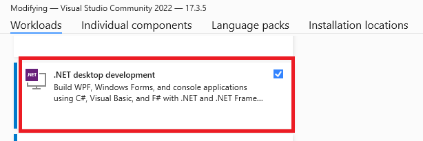
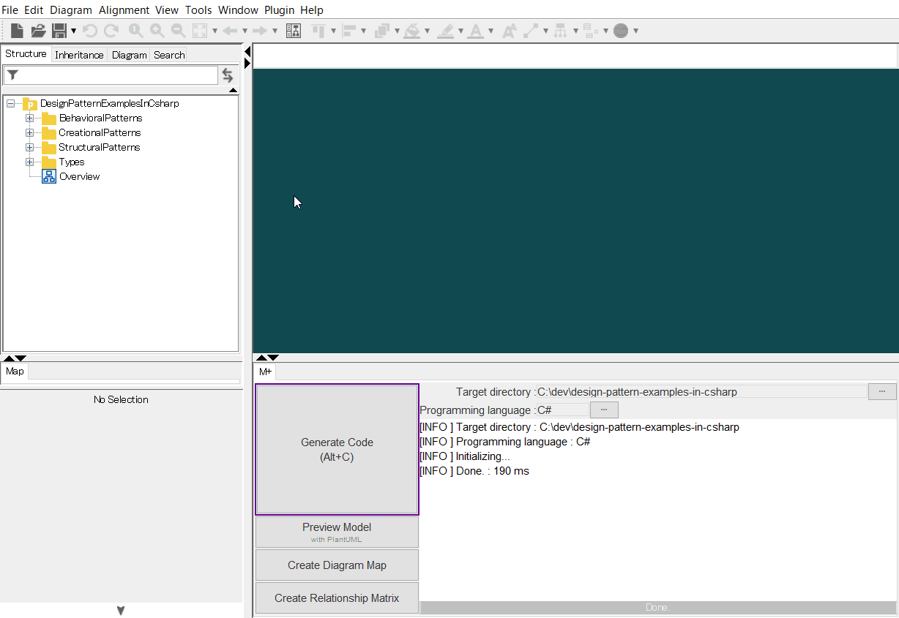
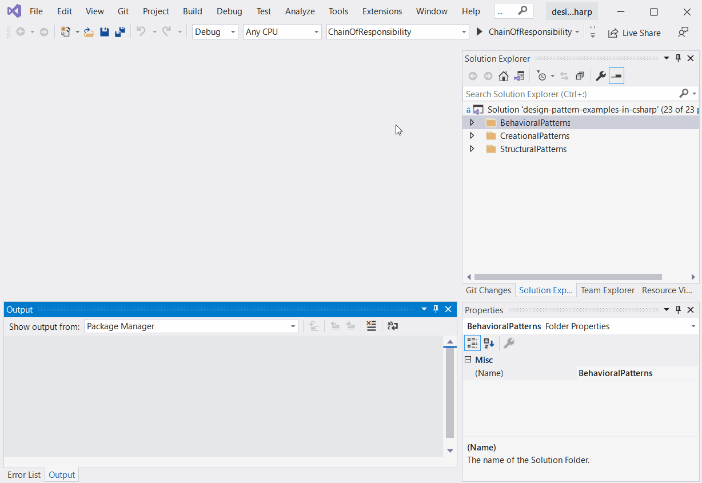

[](https://raw.githubusercontent.com/takaakit/design-pattern-examples-in-csharp/master/screenshots/DiagramMap.svg)

Design Pattern Examples in C#
===

Model and code examples of GoF Design Patterns for C#.  
This project is available for the following objectives:  

* To understand GoF Design Pattern examples in C#.
* To understand the mapping between UML model and C# code.
* To try Model-Driven Development (MDD) using Astah and M PLUS plug-in.

> UML model example:


<a id="code-example"></a>
> C# file example:

```csharp
// ˅
using System;
using System.Collections.Generic;
using System.Text;

// ˄

namespace StructuralPatterns.Composite
{
    public class File : FileSystemElement
    {
        // ˅

        // ˄

        public override string Name
        {
            // ˅
            get;
            // ˄
        }

        public override int Size
        {
            // ˅
            get;
            // ˄
        }

        public File(string name, int size)
            // ˅
            
            // ˄
        {
            // ˅
            Name = name;
            Size = size;
            // ˄
        }

        // Print this element with the "upperPath".
        public override void Print(string upperPath)
        {
            // ˅
            Console.WriteLine($"{upperPath}/{this}");
            // ˄
        }

        // ˅
        
        // ˄
    }
}

// ˅

// ˄
```

Installation on Windows
------------
**UML Modeling Tool**
* Download the modeling tool [Astah](http://astah.net/download) UML or Professional, and install.  
* Download [M PLUS](https://sites.google.com/view/m-plus-plugin/download) plug-in **ver.2.4.0** or higher, and add it to Astah.  
  [How to add plugins to Astah](https://astahblog.com/2014/12/15/astah_plugins/)

**Visual Studio**
* Download and install [Visual Studio](https://visualstudio.microsoft.com/vs/).  
  Check "**.NET desktop development**" when installing.  
  

Usage on Windows
-----
**Code Generation from UML**
  1. Open the Astah file (model/DesignPatternExamplesInCsharp.asta).
  2. Select model elements on the model browser of Astah.
  3. Click the **Generate Code** button.  
    
  The generated code has **User Code Area**. The User Code Area is the area enclosed by "˅" and "˄". Handwritten code written in the User Code Area remains after a re-generation. [View code example](#code-example).  
  For detailed usage of the tools, please see [Astah Manual](http://astah.net/manual) and [M PLUS plug-in Tips](https://sites.google.com/view/m-plus-plugin-tips).

**Build and Run**
  1. Open the solution file (design-pattern-examples-in-csharp.sln) in Visual Studio.
  2. Set up a startup project, and run it.  
       

References
----------
* Gamma, E. et al. Design Patterns: Elements of Reusable Object-Oriented Software, Addison-Wesley, 1994
* Hiroshi Yuki. Learning Design Patterns in Java [In Japanese Language], Softbank publishing, 2004

Licence
-------
This project is licensed under the Creative Commons Zero (CC0) license. The model and code are completely free to use.

[](http://creativecommons.org/publicdomain/zero/1.0/deed)

Other Language Examples
-----------------------
[C++](https://github.com/takaakit/design-pattern-examples-in-cpp), [Crystal](https://github.com/takaakit/design-pattern-examples-in-crystal), [Go](https://github.com/takaakit/design-pattern-examples-in-golang), [Java](https://github.com/takaakit/design-pattern-examples-in-java), [JavaScript](https://github.com/takaakit/design-pattern-examples-in-javascript), [Kotlin](https://github.com/takaakit/design-pattern-examples-in-kotlin), [Python](https://github.com/takaakit/design-pattern-examples-in-python), [Ruby](https://github.com/takaakit/design-pattern-examples-in-ruby), [Scala](https://github.com/takaakit/design-pattern-examples-in-scala), [Swift](https://github.com/takaakit/design-pattern-examples-in-swift), [TypeScript](https://github.com/takaakit/design-pattern-examples-in-typescript)
