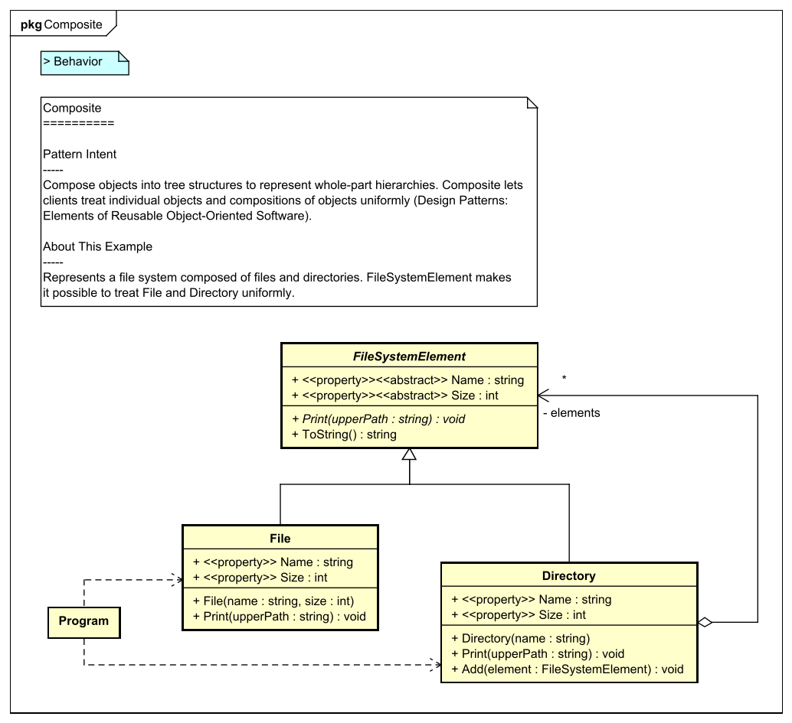

[](https://raw.githubusercontent.com/takaakit/design-pattern-examples-in-csharp/master/screenshots/DiagramMap.svg)

Design Pattern Examples in C#
===

Model and code examples of GoF Design Patterns for C#.  
This project is available for the following objectives:  

* To understand GoF Design Pattern examples in C#.
* To understand the mapping between UML model and C# code.
* To try Model-Driven Development (MDD) using Astah and M PLUS plug-in.

> UML model example:



> C# file example:
---
```cpp:File class
// ˅
using System;
using System.Collections.Generic;
using System.Text;

// ˄

namespace StructuralPatterns.Composite
{
    public class File : FileSystemElement
    {
        // ˅

        // ˄

        public override string Name
        {
            // ˅
            get;
            // ˄
        }

        public override int Size
        {
            // ˅
            get;
            // ˄
        }

        public File(string name, int size)
            // ˅
            
            // ˄
        {
            // ˅
            Name = name;
            Size = size;
            // ˄
        }

        // Print this element with the "upperPath".
        public override void Print(string upperPath)
        {
            // ˅
            Console.WriteLine($"{upperPath}/{this}");
            // ˄
        }

        // ˅
        
        // ˄
    }
}

// ˅

// ˄
```

Installation
------------
**Astah**
* Download Astah UML or Professional from [Change Vision site](http://astah.net/download), and install.  

**M PLUS plug-in**
* Download the plug-in from [M PLUS plug-in site](https://sites.google.com/view/m-plus-plugin/download), and install.  
  Use **ver.2.4.0** or higher.

**Visual Studio IDE**
* .NET Core 3.1 is required, so download and install [Visual Studio 2019](https://visualstudio.microsoft.com/vs/) version **16.4** or higher.  
  Tested and confirmed to work on Windows 10.

Usage
-----
* Select model elements on the model browser of Astah, and press the "Generate code" button to generate.  
* The generated code has "User Code Area". The "User Code Area" is the area enclosed by "˅" and "˄". Handwritten code written in the "User Code Area" remains after a re-generation.
* Set up a startup project in Visual Studio, build and run it.
* For detailed usage of the tools, please see [Astah Manual](http://astah.net/manual) and [M PLUS plug-in Tips](https://sites.google.com/view/m-plus-plugin-tips).


References
----------
* Gamma, E. et al. Design Patterns: Elements of Reusable Object-Oriented Software, Addison-Wesley, 1994
* Hiroshi Yuki. Learning Design Patterns in Java [In Japanese Language], Softbank publishing, 2004

Licence
-------
This project is licensed under the Creative Commons Zero (CC0) license. The model and code are completely free to use.

[](http://creativecommons.org/publicdomain/zero/1.0/deed)
